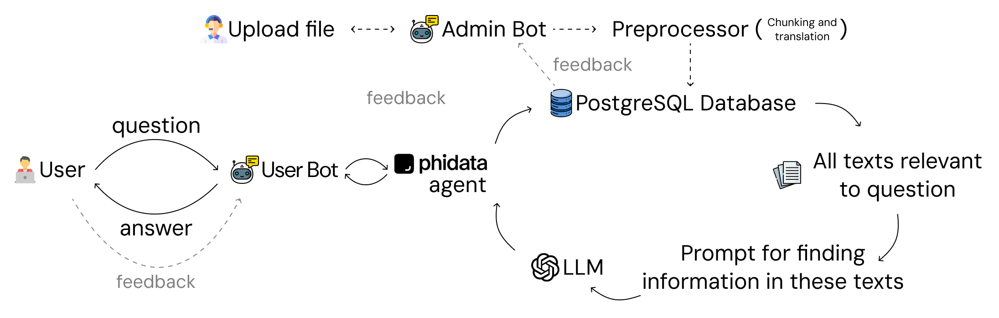

# CSAI Question & Answering Bot

The **CSAI Question & Answering Bot** is tailored specifically for students in the **Computer Science and Artificial Intelligence (CSAI)** JetBrains program at **Neapolis University Pafos**. This bot assists students by providing precise answers to their queries using program-related documents, resources, and materials.

## Features

- **Program-Specific Knowledge Base:**
  The bot is trained and configured to use official documents, guides, and resources from the CSAI program at JetBrains.

- **Natural Language Understanding:**
  Utilizes phidata framework for building multi-modal agents to understand and process student queries effectively.

- **Document-Based Answers:**
  Fetches accurate answers by referencing relevant CSAI documentation.

- **Interactive and Scalable:**
  Handles multiple queries simultaneously with an interactive interface.

## System Disign & Possible Scenarios

  
## Usage

1. **Telegram Bot**
   For now we have only Telegram bot. You can use by https://t.me/csai_assistant_bot/
   
## Contributing

We welcome contributions to improve the bot! Here's how you can contribute:

1. **Fork the repository.**
2. **Create a new branch for your feature or fix:**
   ```bash
   git checkout -b feature-name
   ```
3. **Commit your changes:**
   ```bash
   git commit -m "Add feature or fix description"
   ```
4. **Push to your branch:**
   ```bash
   git push origin feature-name
   ```
5. **Submit a pull request for review.**

## License

This project is licensed under the **MIT License**.

## Acknowledgements

- This bot was developed for CSAI JetBrains students at Neapolis University Pafos to enhance their learning experience.
- Thanks to all contributors, CSAI program and JetBrains for providing the resources and inspiration for this project.
